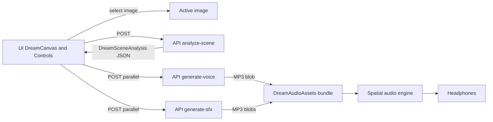

# Architecture

Lucid turns an image into a guided dream: a generated narrative voice plus spatialized sound effects, played in sync through a Web Audio graph.

## High-Level Flow

## Core Subsystems And Entry Points

- UI orchestration: `src/components/dream-canvas/dream-canvas.tsx`
- Scene analysis client: `src/hooks/useGemini.ts`
- Audio asset generation client: `src/hooks/useDreamAudio.ts`
- Spatial audio engine: `src/hooks/useSpatialAudio.ts`
- Image generation client: `src/hooks/useDreamImage.ts`
- API routes: `src/app/api/*/route.ts`
- Shared clients: `src/lib/openrouter.ts`, `src/lib/elevenlabs.ts`
- State: `src/store/use-audio-store.ts`, `src/store/use-settings-store.ts`
- Data types: `src/types/dream.ts`

## Design Constraints (As Implemented)

- Server work runs in Node runtime for API routes (`export const runtime = "nodejs";`).
- `analyze-scene` requests strict JSON via a JSON schema and retries up to 3 times on invalid output.
- Audio playback sync uses the narrator element time as the master clock; SFX gains and 3D positions are updated every animation frame.
